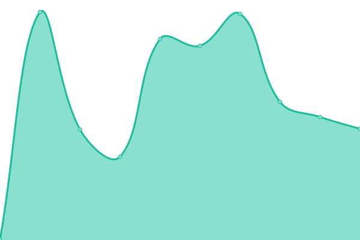

# [📈 Live Status](https://ChrisCarini.github.io/upptime): <!--live status--> **🟧 Partial outage**

This repository contains the open-source uptime monitor and status page for [ChrisCarini](https://ChrisCarini.github.io/upptime), powered by [Upptime](https://github.com/upptime/upptime).

With [Upptime](https://upptime.js.org), you can get your own unlimited and free uptime monitor and status page, powered entirely by a GitHub repository. We use [Issues](https://github.com/ChrisCarini/upptime/issues) as incident reports, [Actions](https://github.com/ChrisCarini/upptime/actions) as uptime monitors, and [Pages](https://ChrisCarini.github.io/upptime) for the status page.

<!--start: status pages-->
<!-- This summary is generated by Upptime (https://github.com/upptime/upptime) -->
<!-- Do not edit this manually, your changes will be overwritten -->
<!-- prettier-ignore -->
| URL | Status | History | Response Time | Uptime |
| --- | ------ | ------- | ------------- | ------ |
|  [chriscarini.com](https://chriscarini.com) | 🟥 Down | [chriscarini-com.yml](https://github.com/ChrisCarini/upptime/commits/HEAD/history/chriscarini-com.yml) | 

 1210ms
     
 | 

<a href="https://ChrisCarini.github.io/upptime/history/chriscarini-com">99.79%</a>
    

|  [jetbrains.chriscarini.com](https://jetbrains.chriscarini.com) | 🟥 Down | [jetbrains-chriscarini-com.yml](https://github.com/ChrisCarini/upptime/commits/HEAD/history/jetbrains-chriscarini-com.yml) | 

 305ms
     
 | 

<a href="https://ChrisCarini.github.io/upptime/history/jetbrains-chriscarini-com">99.52%</a>
    

|  [skypi.chriscarini.com](https://skypi.chriscarini.com) | 🟥 Down | [skypi-chriscarini-com.yml](https://github.com/ChrisCarini/upptime/commits/HEAD/history/skypi-chriscarini-com.yml) | 

 590ms
     
 | 

<a href="https://ChrisCarini.github.io/upptime/history/skypi-chriscarini-com">99.80%</a>
    

|  [blog.chriscarini.com](https://blog.chriscarini.com) | 🟩 Up | [blog-chriscarini-com.yml](https://github.com/ChrisCarini/upptime/commits/HEAD/history/blog-chriscarini-com.yml) | 

 382ms
     
 | 

<a href="https://ChrisCarini.github.io/upptime/history/blog-chriscarini-com">100.00%</a>
    

|  [flask-over-fastcgi.demo.chriscarini.com](https://flask-over-fastcgi.demo.chriscarini.com) | 🟥 Down | [flask-over-fastcgi-demo-chriscarini-com.yml](https://github.com/ChrisCarini/upptime/commits/HEAD/history/flask-over-fastcgi-demo-chriscarini-com.yml) | 

 426ms
     
 | 

<a href="https://ChrisCarini.github.io/upptime/history/flask-over-fastcgi-demo-chriscarini-com">99.81%</a>
    

|  [flask-over-mod-rewrite.demo.chriscarini.com](https://flask-over-mod-rewrite.demo.chriscarini.com) | 🟥 Down | [flask-over-mod-rewrite-demo-chriscarini-com.yml](https://github.com/ChrisCarini/upptime/commits/HEAD/history/flask-over-mod-rewrite-demo-chriscarini-com.yml) | 

 305ms
     
 | 

<a href="https://ChrisCarini.github.io/upptime/history/flask-over-mod-rewrite-demo-chriscarini-com">0.00%</a>
    

|  [fastapi-over-fastcgi.demo.chriscarini.com](https://fastapi-over-fastcgi.demo.chriscarini.com) | 🟥 Down | [fastapi-over-fastcgi-demo-chriscarini-com.yml](https://github.com/ChrisCarini/upptime/commits/HEAD/history/fastapi-over-fastcgi-demo-chriscarini-com.yml) | 

 794ms
     
 | 

<a href="https://ChrisCarini.github.io/upptime/history/fastapi-over-fastcgi-demo-chriscarini-com">99.83%</a>
    

|  [fastapi-over-mod-rewrite.demo.chriscarini.com](https://fastapi-over-mod-rewrite.demo.chriscarini.com) | 🟥 Down | [fastapi-over-mod-rewrite-demo-chriscarini-com.yml](https://github.com/ChrisCarini/upptime/commits/HEAD/history/fastapi-over-mod-rewrite-demo-chriscarini-com.yml) | 

 328ms
     
 | 

<a href="https://ChrisCarini.github.io/upptime/history/fastapi-over-mod-rewrite-demo-chriscarini-com">0.00%</a>
    

<!--end: status pages-->

[**Visit our status website →**](https://ChrisCarini.github.io/upptime)

## 📄 License

- Powered by: [Upptime](https://github.com/upptime/upptime)
- Code: [MIT](./LICENSE) © [ChrisCarini](https://ChrisCarini.github.io/upptime)
- Data in the `./history` directory: [Open Database License](https://opendatacommons.org/licenses/odbl/1-0/)
